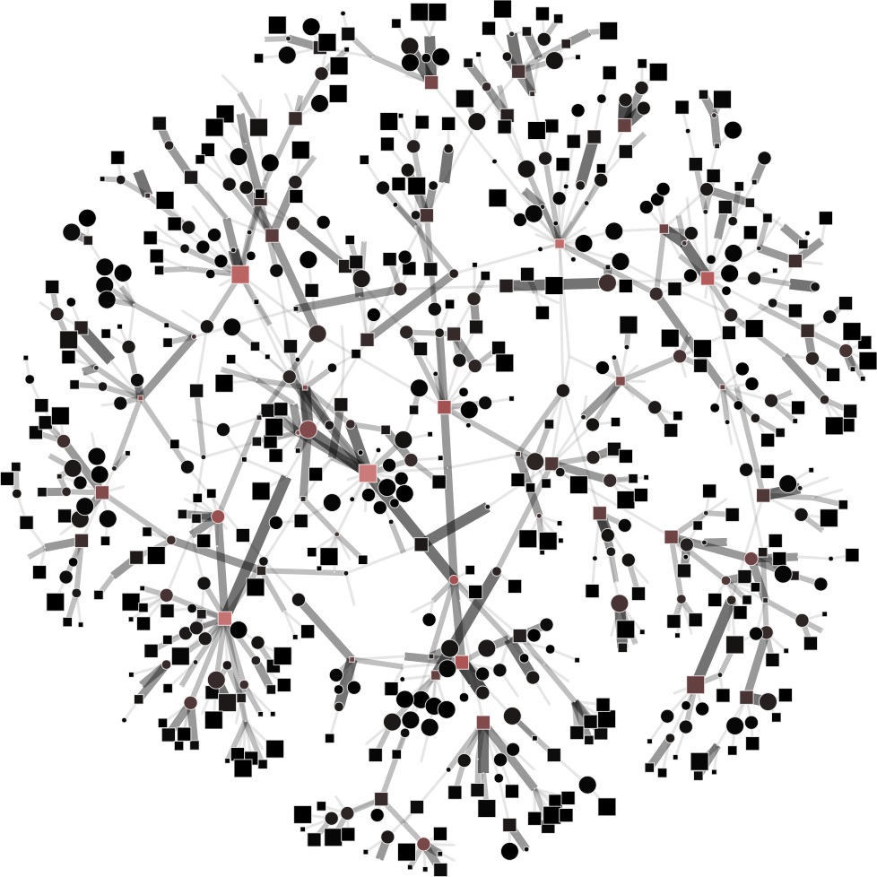
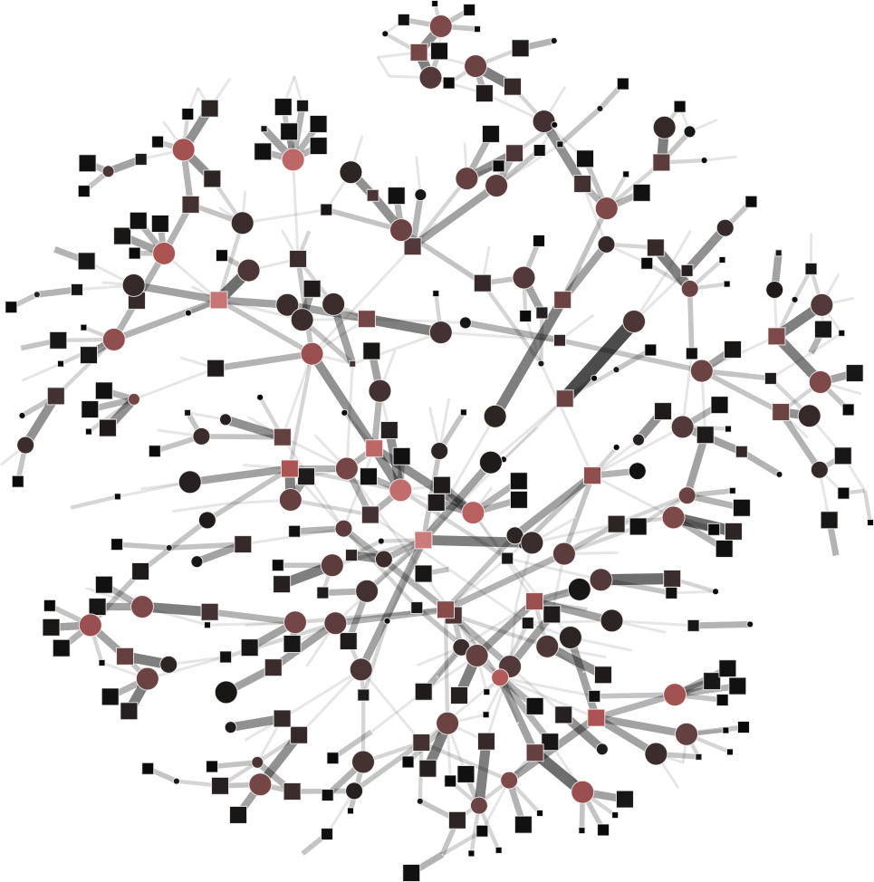
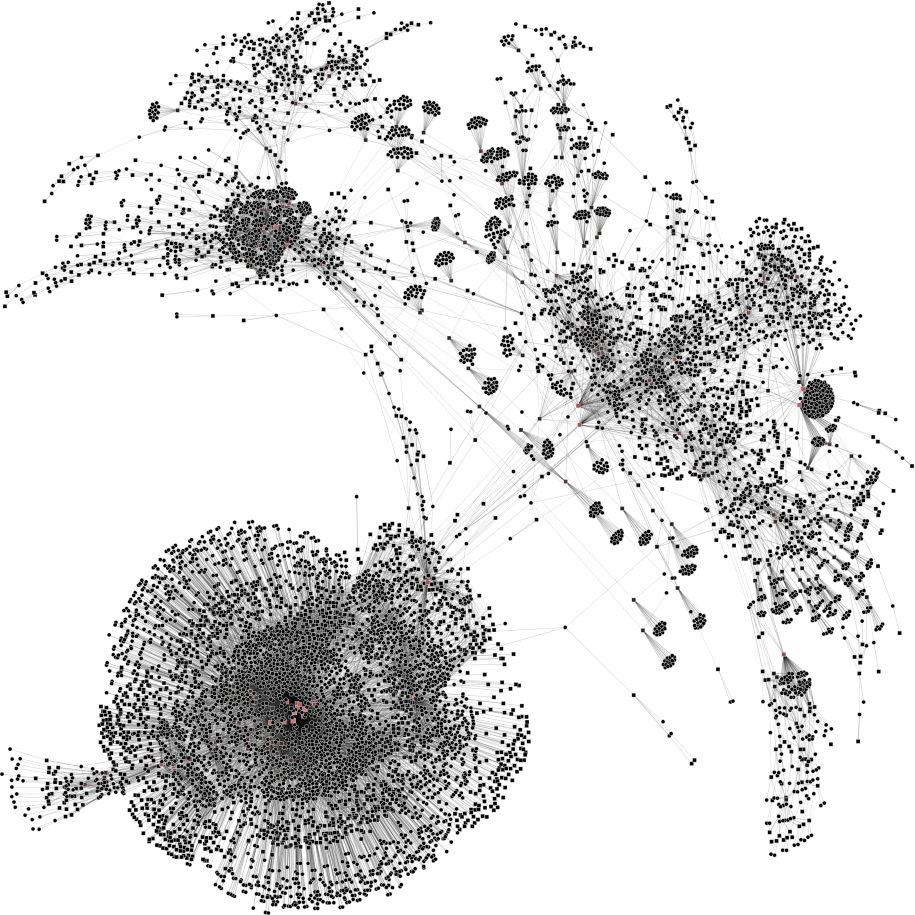

```
Warning
-------
The original implementations (i.e. paper versions [1,2,3,4]) are deprecated.
There may be divergences between this version and the original algorithms.
If you looking for the original version used in the paper don't hesitate to contact the authors.

This software is a new version, more robust and fast.
It is a beta version and has some bugs and inconsistencies.
The final version of this tool will be released is coming soon.
For now, you can use this version without guarantee of the results.
```

### MFBN: Multilevel framework for bipartite networks

**About**

This is a framework that compiles several coarsening algorithms for bipartite networks, specifically: OPM [3,4], 
RGMB [2], GMB [2] and MLPb [1].

A multilevel method is a scalable strategy to solve optimization problems in large bipartite networks, which operates 
in three stages. Initially the input network is iteratively coarsened into a hierarchy of gradually smaller networks. 
Coarsening implies in collapsing vertices into so-called super-vertices which inherit properties of their originating 
vertices. An initial solution is obtained executing the target algorithm in the coarsest network. Finally, this 
solution is successively projected back over the inverse sequence of coarsened networks, up to the initial one, 
yielding an approximate final solution.

An extensive critical survey of the multilevel method in complex networks is presented in [5].

**Usage**

MFBN may operate in two modes: 1. using explicit command line parameters (or options) or 2. using a JSON config file 
(JavaScript Object Notation).

**Command line parameters**

    $ python mfbn.py [options]
    
| Option                     | Domain            | Default                | Description                                                 | Algorithms          |
| -------------------------- | ----------------- | ---------------------- | ----------------------------------------------------------- | ------------------- |
| -dir --output_directory    | str [DIR]         | '.'                    | directory of output file                                    | All                 |
| -out --output              | str [FILE]        | 'out'                  | filename                                                    | All                 |
| -cnf --conf                | str [FILE]        | None                   | Input parameters in .json format                            | All                 |
| -o --output_object         | boolean           | False                  | return python objects dictionary and don't write files      | All                 |
| -v --vertices              | int array [L1,L2] | None                   | number of vertices for each layer                           | All                 |
| -r --reduction_factor      | int array [L1,L2] | [0.5, 0.5]             | reduction factor for each layer                             | All                 |
| -m --max_levels            | int array [L1,L2] | [3, 3]                 | max levels for each layer                                   | OPM, RGMB and GMB   |
| -gmv --global_min_vertices | int array [L1,L2] | [100, 100]             | minimum number of vertices for each layer in the last level | MLPb                |
| -t --tolerance             | int array [L1,L2] | [0.1]                  | tolerance in for each layer                                 | MLPb                |
| -i --itr                   | int array [L1,L2] | [10, 10]               | number of iterations for each layer                         | MLPb                |
| -ub --upper_bound          | int array [L1,L2] | [0.2, 0.2]             | upper bound for each layer                                  | MLPb                |
| -c --matching              | str array [L1,L2] | ["gmb", "gmb"]         | matching method for each layer                              | Algorithm selection |
| -s --similarity            | str array [L1,L2] | ["jaccard", "jaccard"] | similarity measure for each layer                           | All                 |
| -sd --seed_priority        | str array [L1,L2] | ["degree", "degree"]   | seed priority to start the algorithms                       | All                 |
| -scnf --save_conf          | boolean           | false                  | save config file                                            | All                 |
| -sgml --save_gml           | boolean           | false                  | save gml file                                               | All                 |
| -sn --save_ncol            | boolean           | false                  | save ncol file                                              | All                 |
| -ssrc --save_source        | boolean           | false                  | save source file                                            | All                 |
| -smbs --save_membership    | boolean           | false                  | save membership file                                        | All                 |
| -swgh --save_weight        | boolean           | false                  | save weight file                                            | All                 |
| -sprd --save_predecessor   | boolean           | false                  | save predecessor file                                       | All                 |
| -sscc --save_successor     | boolean           | false                  | save successor file                                         | All                 |
| -shrr --save_hierarchy     | boolean           | false                  | save hierarchy of networks                                  | All                 |
| -sc --show_conf            | boolean           | false                  | show conf file                                              | All                 |
| -st --show_timing          | boolean           | False                  | show timing                                                 | All                 |
| -tcsv --save_timing_csv    | boolean           | False                  | save timing in csv                                          | All                 |
| -tjson --save_timing_json  | boolean           | False                  | save timing in json                                         | All                 |
| --unique_key               | boolean           | False                  | output date and time as unique_key                          | All                 |

**JSON option**

    $ python mfbn.py -cnf options.json

JSON format: Data is in name/value pairs, separated by commas, curly braces hold objects and square brackets hold arrays.

```javascript
{
    "option": "value"
}
```

The matching strategy selects the best pairs of vertices for matching. In this software it is possible use six matching
methods:

* OPM_hem [3,4]: `hem` key
* OPM_lem [3,4]: `lem` key
* OPM_rm [3,4]: `rm` key
* RGMb [2]: `rgmb` key
* GMb [2]: `gmb` key
* MLPb [1]: `mlpb` key

In this software it is possible use eleven similarity measures:

* Common Neighbors: `common_neighbors` key
* Weighted Common Neighbors: `weighted_common_neighbors` key
* Preferential Attachment: `preferential_attachment` key
* Jaccard: `jaccard` key
* Salton: `salton` key
* Adamic Adar: `adamic_adar` key
* Resource Allocation: `resource_allocation` key
* Sorensen: `sorensen` key
* Hub Promoted: `hub_promoted` key
* Hub Depressed: `hub_depressed` key
* Leicht Holme Newman: `leicht_holme_newman` key

In this software it is possible use three seeds priorities:

* Degree: `degree` key
* Random: `random` key
* Strength: `strength` key

It is possible use different parameters algorithms in each layer, e.g.:

```javascript
{
    "reduction_factor": [0.3, 0.5],
    "matching": ["gmb", "rgmb"],
    "similarity": ["common_neighbors", "jaccard"]
    ...
}
```

**Example**

To help you visualize the networks generated by the coarsening process you can use the 
[PyNetViewer](https://github.com/alanvalejo/pynetviewer) software. In the network images, line widths reflect the 
corresponding edge weights; vertex widths depict the super-vertex weights. Bright red markers denote high-degree 
vertices.

We tested 3 real networks: 1. Moreno Crime is a social network with scale-free behavior relating 754 crime suspects or 
victims with 509 crimes (Figure 1a); 2. N-reactome is a biological network with modular topology with 8,788 proteins 
and 15,433 interactions in the species Homo Sapiens (Figure 2a); 3. Rajat is a nonsymmetric circuit simulation matrix,
in which 6,765 individual resistors and connection points are defined as edges and vertices, respectively (Figure 3a).
The two first networks are available in the [Koblenz Network Collection (KONECT)](http://konect.uni-koblenz.de/) and 
the last is available from the [SuitSparse Matrix Collection](https://sparse.tamu.edu/).

We use the MLPb algorithm [1] to create a coarsened versions of the previous mentioned networks. Particularly, we 
generated coarsened version with relatively balanced super-vertices (between 0.2 and 0.4 upper bound) and we used
`weighted common neighbor` similarity measure.  

> Moreno Crime network (original size: V1=754; V2=509)

    # Reduce the network to V1=450; V2=350
    $ python coarsening.py -cnf input/moreno-1.json
    
    # Reduce the network to V1=250; V2=150
    $ python coarsening.py -cnf input/moreno-2.json
    
    # Reduce the network to V1=50; V2=100
    $ python coarsening.py -cnf input/moreno-3.json
    
The result is showed below, Figures 1b, 1c and 1d.

| 1a) V1=754; V2=509  | 1b) V1=450; V2=350      | 1c) V1=250; V2=150      | 1d) V1=50; V2=100       |
| ------------------- | ----------------------- | ----------------------- | ----------------------- |
|  |  |  |  |

> N-reactome network (original size: V1=8,788; V2=15,433)

    # Reduce the network to V1=1000; V2=4000
    $ python coarsening.py -cnf input/n-reactome-1.json
    
    # Reduce the network to V1=500; V2=1000
    $ python coarsening.py -cnf input/n-reactome-2.json
    
    # Reduce the network to V1=200; V2=500
    $ python coarsening.py -cnf input/n-reactome-3.json
    
The result is showed below, Figures 2b, 2c and 2d.

| 2a) V1=8788; V2=15433   | 2b) V1=1000; V2=4000        | 2c) V1=500; V2=1000         | 2d) V1=200; V2=500          |
| ----------------------- | --------------------------- | --------------------------- | --------------------------- |
|  |  |  |  |

> Rajat network (original size: V1=6,765; V2=6,765)

    # Reduce the network to V1=V2=3000
    $ python coarsening.py -cnf input/rajat-1.json
    
    # Reduce the network to V1=V2=500
    $ python coarsening.py -cnf input/rajat-2.json
    
    # Reduce the network to V1=V2=150
    $ python coarsening.py -cnf input/rajat-3.json
    
The result is showed below, Figures 3b, 3c and 3d.

| 3a) V1=V2=6765     | 3b) V1=V2=3000         | 3c) V1=V2=500          | 3d) V1=V2=150          |
| ------------------ | ---------------------- | ---------------------- | ---------------------- |
|  |  |  |  |

MLPb algorithm can generate balanced and unbalanced using a upper bound parameter:

| 4a) upper_bound=0.1             | 4b) upper_bound=0.8              |         
| ------------------------------- | -------------------------------- |
|   |  |
    

    $ python coarsening.py -cnf input/rajat-1.json

**Timing**

To track the execution time of the algorithms you can use the fallowing parameters:

```javascript
{
    "show_timing": true,
    "save_timing_csv": false,
    "save_timing_json": false
}
```

E.g., `show_timing` track (and show in bash) the execution time of each algorithm phase: 

    $ python coarsening.py -cnf input/n-reactome-1.json

           Snippet       Time [m]       Time [s]
    Pre-processing            0.0         0.0428
              Load            0.0         0.2623
        Coarsening            0.0         4.9760
              Save            0.0         0.1249

**Instal**

> Pip
    
    $ pip install -r /path/to/requirements.txt

> Anaconda env

    $ conda env create -f environment.yml
    $ conda activate mfbn

> Anaconda create

    $ conda create --name mfbn python=3.7.2
    $ conda activate mfbn
    $ conda install -c anaconda numpy
    $ conda install -c conda-forge python-igraph
    $ conda install -c anaconda pyyaml
    $ conda install -c conda-forge pypdf2
    $ conda install -c anaconda scipy
    $ conda install -c anaconda networkx
    $ conda install -c bioconda sharedmem 

**Release History**

- 0.1.0
    - The first proper release
- 0.0.1
    - Work in progress

**Contributing**

- Pull requests are welcome. For major changes, please open an issue first to discuss what you would like to change.
- Please make sure to update tests as appropriate.

**Known Bugs**

- Please contact the author for problems and bug report.

**Contact**

- Alan Valejo
- alanvalejo@gmail.com.br
- www.alanvalejo.com.br
- Postdoctoral research fellow at the University of São Paulo (USP), Brazil

**License and credits**

- Giving credit to the author by citing the papers [1,2,3,4]
- The GNU General Public License v3.0
- This program comes with ABSOLUTELY NO WARRANTY. THE ENTIRE RISK AS TO THE QUALITY AND PERFORMANCE OF THE PROGRAM IS
WITH YOU.
- Owner or contributors are not liable for any direct, indirect, incidental, special, exemplary, or consequential 
damages, (such as loss of data or profits, and others) arising in any way out of the use of this software, even if 
advised of the possibility of such damage.
- This program is free software and distributed in the hope that it will be useful: you can redistribute it and/or
modify it under the terms of the GNU General Public License as published by the Free Software Foundation, either
version 3 of the License, or (at your option) any later version. See the GNU General Public License for more 
details. You should have received a copy of the GNU General Public License along with this program. If not, see 
http://www.gnu.org/licenses/.

**To-do list**

* Implements the output of the objects

**References**

> [1] Valejo, Alan and Faleiros, T. P. and Oliveira, Maria C. F. and Lopes, A. A., A coarsening method for bipartite
>networks via weight-constrained label propagation, in Knowledge-based systems, p. 105678, vol. 195, 2019, 
>doi: https://doi.org/10.1016/j.knosys.2020.105678
>
> [2] Valejo, Alan and Oliveira, Maria C. F. and Filho, Geraldo P. R. and Lopes, A. A., Multilevel approach for 
>combinatorial optimization in bipartite network, in Knowledge-based systems, p. 45--61, vol. 151, 2018, 
>doi: https://doi.org/10.1016/j.knosys.2018.03.021
>
> [3] Valejo, Alan and Ferreira, V. and Oliveira, Maria C. F. and Lopes, A. A., Community detection in bipartite 
>network: a modified coarsening approach, in International symposium on information management and big data (SIMBig), 
>track on social network and media analysis and mining (SNMAN). Part of the Communications in Computer and Information 
>Science book series (CCIS, volume 795), p. 123--136, 2017, doi: https://doi.org/10.1007/978-3-319-90596-9_9
>
> [4] Valejo, Alan and Filho, Geraldo P. R. and Oliveira, Maria C. F. and Ferreira, V. and Lopes, A. A., One-mode 
>projection-based multilevel approach for community detection in bipartite networks, in International symposium on 
>information management and big data (SIMBig), track on social network and media analysis and mining (SNMAN), 
>p. 101-108, 2017 , doi: http://ceur-ws.org/Vol-2029/paper8.pdf
>
> [5] Valejo, Alan and Ferreira, V. and Fabbri, R. and Oliveira, Maria C. F. and Lopes, A. A., A critical survey of the 
>multilevel method in complex networks, in ACM Computing Surveys, accepted paper, 2019

~~~~~{.bib}
@article{valejo2020coarsening,
    author = {Valejo, Alan and Faleiros, T. P. and Oliveira, Maria C. R. F. and Lopes, A.},
    title = {A coarsening method for bipartite networks via weight-constrained label propagation},
    journal = {Knowledge-Based Systems},
    year = {2020},
    volume = {195},
    pages = {105678},
}
@article{valejo2018multilevel,
    author = {Valejo, Alan and Oliveira, Maria C. F. and Filho, Geraldo P. R. and Lopes, A. A.},
    title = {Multilevel approach for combinatorial optimization in bipartite network},
    journal = {Knowledge-based systems},
    year = {2018},
    pages = {45--61},
    volume = {151},
}
@inproceedings{valejo2018community,
    author = {Valejo, Alan and Ferreira, V. and Oliveira, Maria C. F. and Lopes, A. A.},
    title = {Community detection in bipartite network: a modified coarsening approach},
    booktitle = {International symposium on information management and big data (SIMBig), track on social network and media analysis and mining (SNMAN). Part of the Communications in Computer and Information Science book series (CCIS, volume 795)},
    year = {2018},
    pages = {123--136},
}
@inproceedings{valejo2017one,
    author = {Valejo, Alan and Filho, Geraldo P. R. and Oliveira, Maria C. F. and Ferreira, V. and Lopes, A. A.},
    title = {One-mode projection-based multilevel approach for community detection in bipartite networks},
    booktitle = {International symposium on information management and big data (SIMBig), track on social network and media analysis and mining (SNMAN)},
    year = {2017},
    pages = {101-108},
}
@article{valejo2019critical,
    author = {Valejo, Alan and Ferreira, V. and Fabbri, R. and Oliveira, Maria C. F. and Lopes, A. A.},
    title = {A critical survey of the multilevel method in complex networks},
    journal = {ACM Computing Surveys, accepted paper},
    year = {2020}
}
~~~~~

<div class="footer"> &copy; Copyright (C) 2016 Alan Valejo &lt;alanvalejo@gmail.com&gt; All rights reserved.</div>
